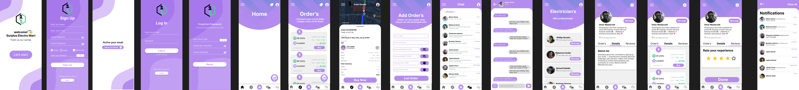

# Grenn Power Mart - Mobile Application



## Table of Contents

1. [Introduction](#introduction)
2. [Features](#features)
3. [Screenshots](#screenshots)
4. [Installation](#installation)
5. [Usage](#usage)
6. [Technology Stack](#technology-stack)
7. [Project Structure](#project-structure)
8. [Contributing](#contributing)
9. [License](#license)
10. [Contact](#contact)

## Introduction

**Grenn Power Mart** is a mobile application designed to connect users with available electricians and electrical equipment suppliers in their vicinity. The app provides users with functionalities to order electrical supplies, chat with service providers, and rate their experience.

## Features

- **User Authentication**: Sign up, login, and password recovery.
- **Order Management**: View, add, and manage orders.
- **Real-Time Chat**: Communicate with electricians and service providers.
- **Rating System**: Rate your experience with the service providers.
- **Notifications**: Stay updated with real-time notifications.

## Screenshots


## Installation

To get started with the app locally, follow these steps:

1. Clone the repository:

   ```bash
   git clone https://github.com/waqarahsan28/Green-power-mart-frontend-
   ```

2. Navigate to the project directory:

   ```bash
   cd yourrepo
   ```

3. Install dependencies:

   ```bash
   npm install
   ```

4. Start the development server:

   ```bash
   npm start
   ```

5. Use Expo Go to scan the QR code and run the app on your device.

## Usage

Once the app is running, you can:

- **Sign up/Login**: Register a new account or log into an existing one.
- **Browse Orders**: View available electrical supplies and place orders.
- **Chat**: Message electricians or service providers.
- **Rate Services**: Provide feedback on the service received.
- **Receive Notifications**: Stay informed with order updates and messages.

## Technology Stack

- **Frontend**: React Native with Expo
- **Backend**: Node.js (Express) with socket.io
- **Storage**: LocalStorage for client-side data management

## Project Structure

The project is structured as follows:

```plaintext
.
├── assets          # Image and font assets
├── components      # Reusable UI components
├── screens         # Screen components for each app section
├── navigation      # App navigation configuration
├── services        # API service files and utilities
└── App.js          # Main entry point of the app
```

## Contact

For any inquiries or questions, feel free to reach out:

- **Email**: muhwaqar28@gmail.com
- **GitHub**: [waqarahsan28](https://github.com/waqarahsan28/)
